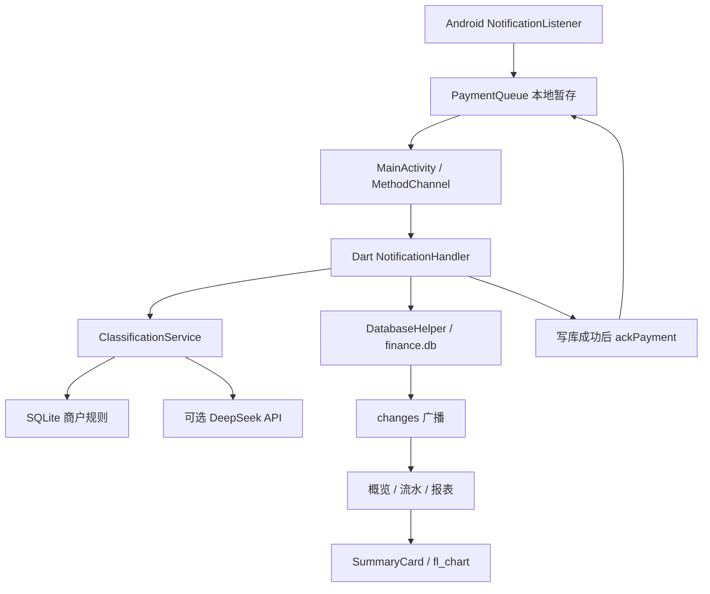

# 代码架构与审查记录

审查日期：2026-09-07。检查范围：lib 下所有 Dart 文件、Android Kotlin 通知桥接、Manifest、Gradle、依赖与测试；iOS/其他平台按入口和配置检查，没有完成平台构建。当前目录不是 Git 仓库，修改已直接写入工作目录。

## 1. 架构是什么

整体是轻量分层 Flutter 应用，不是完整的 MVVM/Clean Architecture。页面 State 直接调用数据库服务并保存页面数据；Provider 负责把 DatabaseHelper 提供给 UI，并没有集中式业务状态仓库。服务层仍使用单例，是目前最主要的耦合点。

| 目录 / 文件 | 责任 |
| --- | --- |
| lib/main.dart | 初始化 Flutter、打开数据库、启动通知导入、注入数据库；初始化失败提供重试 |
| lib/app.dart | MaterialApp、主题、MainShell；IndexedStack 保留四个页面状态 |
| lib/screens | 概览、流水、报表、设置；DataRefreshMixin 订阅数据库变更和应用恢复事件 |
| lib/database/database_helper.dart | SQLite 建表/迁移、交易 CRUD、分类、商户规则、汇总查询 |
| lib/models | Transaction 与 Category，负责字段定义和数据库序列化 |
| lib/services | 通知导入、本地优先分类、可选 AI HTTP 请求 |
| lib/widgets | 统计卡片、分类饼图、月柱图、年趋势图 |
| android/.../NotificationListener.kt | 限定来源和支付通知格式，提取金额与商户，写入暂存队列 |
| android/.../PaymentQueue.kt | 应用私有 SharedPreferences 暂存，Flutter 引擎不存在时仍能保存已收到的通知 |
| android/.../MainActivity.kt | 提供读取队列、确认导入、打开系统通知使用权设置的通道 |
| test | 真 SQLite FFI 数据测试、HTTP 模拟测试和 Flutter 交互/图表测试 |

数据库现在是 v2：transactions 保存交易并增加可空 event_id 唯一索引，categories 保存默认分类，merchant_rules 保存规则与 AI 学习结果。v1 升级使用 ALTER TABLE，不删除原有流水；旧流水 event_id 保持 NULL。

新交易写入完成后发出 changes 事件。三个数据页面收到事件重新查询；恢复前台时也刷新。异步查询带版本号，防止较慢的旧请求覆盖新筛选结果。IndexedStack 本身并不会在切换标签时重新执行 initState。

## 2. 已确认的问题及修改

| 原问题 | 影响 | 修改 |
| --- | --- | --- |
| 概览通过 dynamic 操作祖先 State 的私有 _currentIndex | 点击入口可能 NoSuchMethodError | 改为显式 onViewTransactions 回调，由 MainShell 切换标签 |
| 来源筛选传 wechat/alipay，但下拉项使用中文；清空被转换成 alipay | 断言失败、筛选无法还原 | UI 标签与数据库值分别转换，NULL 保持「全部」 |
| 「全部流水」实际上限定本月；收入也显示负号 | 历史记录不可见、金额方向误导 | 流水取消隐含月份限制，按 isExpense 显示正负号 |
| 页面只在 initState 加载，通知写入后无刷新；异常一直转圈 | 新流水和汇总不一致、失败无反馈 | 数据库变更广播、前台恢复刷新、错误重试、请求版本检查；空列表可下拉 |
| 每次 AiService() 都是新对象 | 设置页输入的 Key 无法被分类服务使用 | 共享单例；Key 输入遮挡；明确仅本次运行有效与商户名外发行为 |
| HTTP 中文响应解码不明确，AI 任意文本被当作分类 | 分类乱码或错误规则污染 | 显式 UTF-8 解码、分类白名单、失败退回本地逻辑；未知商户不做 AI 学习 |
| 月末截止 23:59:59 | 最后一秒的小数部分漏算 | 所有日期范围统一为 [startDate, endDate)，截止用次月 1 日零点 |
| 日均用有消费的天数做分母 | 一天消费可能被误认为整月日均 | 概览按月初至今日的自然日数计算，无消费日期也计入分母 |
| 月柱图 x 从 0 开始而标签直接显示 x 月 | 显示 0～11 月 | 改成 1～12 月 |
| 趋势缺失月份被直接跨越，零金额图表可能产生 0 刻度间隔 | 图表误导或断言异常 | 补齐 12 个月，直线连接，正数 Y 范围；饼图排除非正/非有限值 |
| 动态 IconData 与硬编码图标映射 | Release 字体裁剪风险、图标不对应 | 使用 const Icons 映射；保留旧数据库字段兼容 |
| 并发初始化数据库，写入无金额校验 | 竞态和异常数值进入报表 | 复用初始化 Future、有限正数校验；更新必须有 ID |
| LIKE 将规则里的 %、_ 当作通配符，匹配顺序未定义 | 泛化规则误判 | 用 instr 做字面匹配，长规则优先，再按新规则优先 |
| Android 只向当前 FlutterEngine 发消息，没有持久化或去重 | 界面关闭漏记，重放重复 | 先本地暂存，再串行导入；数据库事务按 event_id 去重，提交后确认删除；清理引擎引用 |
| 任意微信/支付宝通知出现 ¥ 就入账 | 聊天、营销、收入可能被记为支出 | 来源包名、标题、成功语义和负向词过滤，跳过分组摘要；这是保守解析器，需真实样本验收 |
| 没有打开通知读取设置的入口，Release 没有 INTERNET | 用户难以开启，AI 发布包联网失败 | 增加系统设置入口和 INTERNET；移除没有实现对应功能的发送通知/前台服务权限 |
| Release 使用 debug 签名 | 测试密钥进入发布路径 | 改为 key.properties 发布签名配置，常规 Release 任务缺配置时报错，提供空模板 |
| 测试只有 1+1 | 无法验证业务 | 替换为 16 项实际回归测试 |

统计定义：概览支出与交易笔数统计本月，日均统计月初至今天结束。报表饼图始终是「本月支出分类」，年份下拉只控制两个年度图表，标题已区分此语义。所有日期参数的 endDate 均为排他上界，未来调用者必须遵守。

## 3. 仍然存在的限制与优先级

以下不是已完成能力，也不是可以通过当前自动化测试推断通过的项目：

### 发布前必须完成

1. **Android 真机链路**：本机无 Android SDK，Kotlin、Gradle 签名配置和原生队列尚未编译/真机验证。需完成通知授权、退出界面补录、重启、去重、升级和 Release 网络验证。
2. **通知格式和真实支付去重**：目前只支持白名单标题和明确支付成功格式，严格过滤会漏掉其他格式。event_id 是系统通知 key + postTime，只能幂等处理同一事件；同一支付以不同通知 ID/时间再次推送仍可能重复。通知内容也不是银行交易凭据。应收集脱敏真实样本、加入解析器测试，并以业务流水号或人工确认增强可靠性。
3. **通知不可用场景**：关闭微信/支付宝通知、没有系统通知、强行停止应用、厂商限制监听服务时，应用无法保证收到事件。暂存队列只能保护已经被监听服务收到且成功落盘的事件。
4. **可纠错入口**：数据库有更新/删除方法，但 UI 没有手动新增、编辑、删除、退款处理、账单导入和对账。要作为正式个人账本，必须能修正误判和补录漏记。
5. **资金精度**：当前 amount 为 double/SQLite REAL，存在浮点累加误差。建议后续独立迁移为整数「分」，明确四舍五入策略，并核验历史记录迁移。此次未静默改变既有金额存储。

### 后续工程改进

- SharedPreferences 队列目前同步写入，适合低频原型；大量积压会影响主线程。升级为原生 SQLite 队列、分页消费、失败隔离、重试退避和可见的导入状态。当前异常会保留待导入数据，重启或恢复前台重试；损坏事件可能阻塞后续导入。
- 流水当前加载所有记录；数据量增长后应分页。首页为统计笔数仍取完整交易，应改 COUNT 查询。
- 日期是本地 ISO 文本，跨时区旅行、历史 UTC 导入与设备时区变化没有统一策略；建议定义固定账本时区或以时间戳存储并集中转换。
- 密钥仅在内存中使用；若需要持久保存，应接入系统安全存储并单独测试迁移/清除。账本和原生队列未做应用层加密，也没有备份恢复功能，需要按产品数据策略补齐。
- categories 表与 UI 默认分类仍有重复数据源；无自定义分类编辑。建议引入 repository 接口和统一分类状态，减少单例与直接数据库依赖。
- iOS 没有第三方通知采集实现，Web/Windows/Linux 没有配置可用的生产数据库后端。不能把生成的平台目录当作功能支持声明。
- 当前没有 CI、版本库、自动发布流水线；先初始化版本控制，纳入 lint/test 和 Android 构建检查，再考虑发布自动化。

## 4. 已执行验证

2026-09-07，Flutter 3.44.9 / Dart 3.12.2：

- flutter pub get：成功，锁文件新增 SQLite FFI 测试相关依赖。
- dart format lib test：完成。
- flutter analyze --no-pub：No issues found。
- flutter test --no-pub：16 项通过；SQLite 测试使用独立内存库/临时文件，没有读取用户 finance.db。
- flutter doctor -v：Android SDK 缺失、无 Android 设备，Flutter/Dart 未加入 PATH；Windows C++ 构建环境缺失，Maven 连通性检查出现 TLS 失败。
- flutter build apk --debug --no-pub：实际尝试，退出码 1，No Android SDK found。没有生成可安装 APK，也没有执行生产发布。

数据库测试覆盖初始化并发、日期边界、日均、幂等、非法金额、规则优先级、v1 升级；界面测试覆盖快捷跳转、筛选复位、自动刷新、收入符号、错误重试、图表；HTTP 测试用 MockClient，不发送真实密钥或商户数据。
